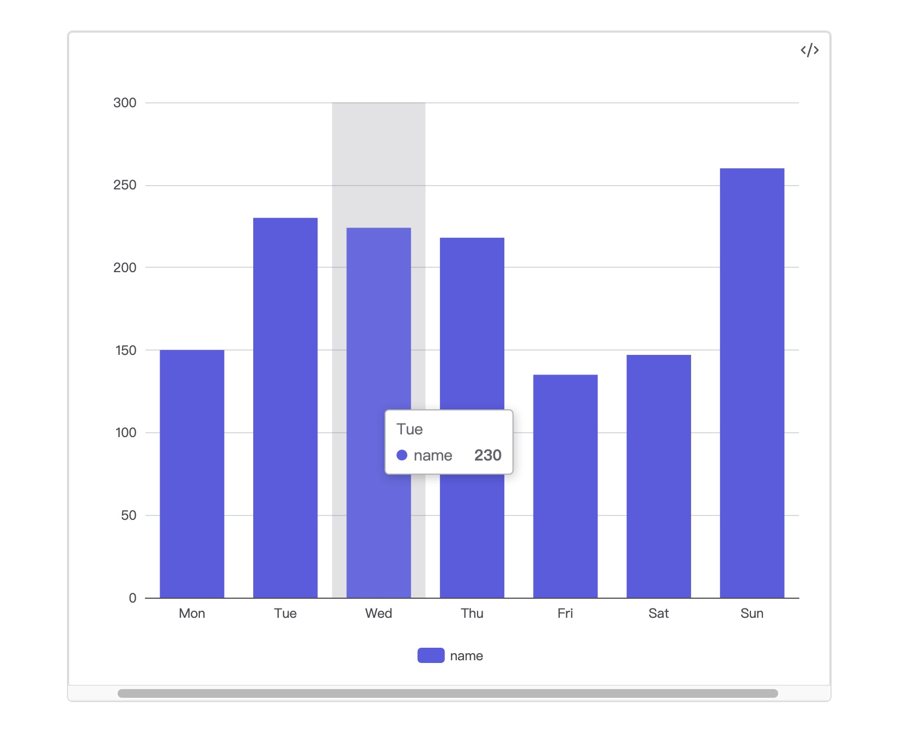

# Obsidian echarts lite

Feature:

- compatiable with mobile
- latest echarts version(v6.0.0)

## Install

### install from obsidian plugin market

- Not published yet

### manual install

- download assets from [release](https://github.com/x-ideas/obsidian-echarts-lite/releases)
- create a folder named `echarts-lite` in your obsidian vault plugin folder({your obsidian vault path}/.obsidian/plugins/)
- move the downloaded assets to the new created folder
- reload Obsidian
- enable the plugin

## How to Use

````ts
```dataviewjs

const option = {
	tooltip: {
		trigger: "axis",
		axisPointer: {
			type: "shadow",
		},
	},
	legend: {},
	xAxis: {
		type: "category",
		data: ["Mon", "Tue", "Wed", "Thu", "Fri", "Sat", "Sun"],
	},
	yAxis: {
		type: "value",
	},
	series: [
		{
			name: "name",
			data: [150, 230, 224, 218, 135, 147, 260],
			type: "bar",
		}
	]
}
app.plugins.plugins['echarts-lite'].api.render(option, this.container)
````

and the result will be like this:


## Other

- ispired by [obsidian-echarts](https://github.com/cumany/obsidian-echarts)
